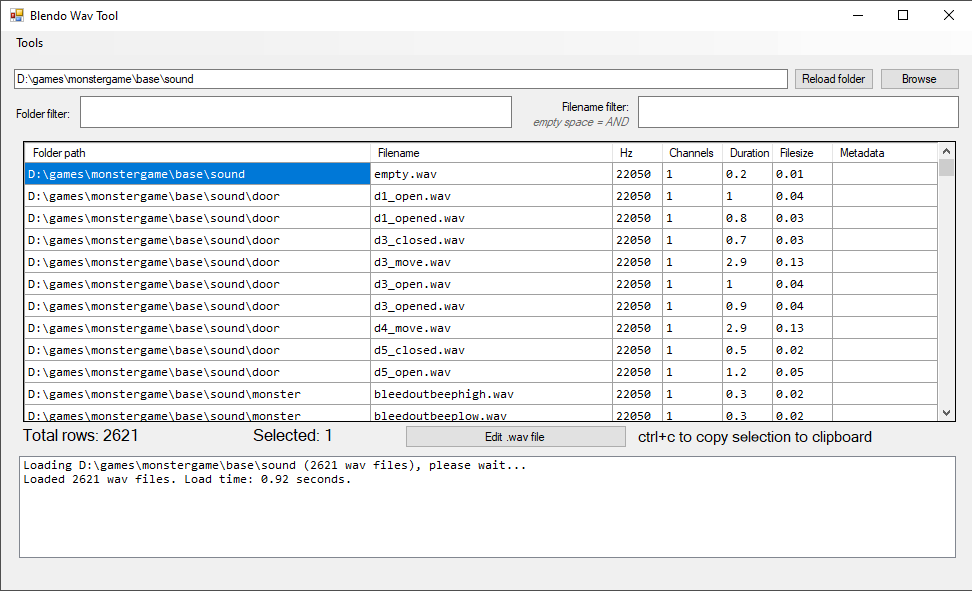

# Blendo Wav Tool

## About
This is a tool for sorting/browsing/managing game audio assets.

This tool was made specifically for idTech4 projects but can be adapted for more general use. More [details here](https://blendogames.com/news/post/2025-03-03-wavtool).

This is written in C# and a .sln solution for Visual Studio 2015 is provided. Windows only.

Pre-compiled binaries [available here](https://github.com/blendogames/BlendoWavTool/releases/tag/release).

## License
This source code is licensed under the MIT license.

## Credits
by [Brendon Chung](https://blendogames.com)

## Libraries used
- [TagLibSharp](https://github.com/mono/taglib-sharp)
- [NAudio](https://github.com/naudio/NAudio)
- [Vosk Speech Recognition Toolkit](https://github.com/alphacep/vosk-api)
